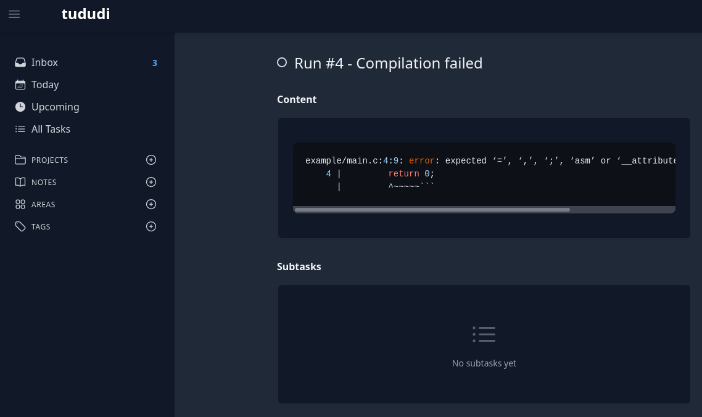

# td GitHub Action

## Table of Contents
- [Description](#description)
- [Usage](#usage)
- [Maintainers](#maintainers)
- [Contributing](#contributing)

## Description
This GitHub Action sets up the [td](https://git.sr.ht/~klahr/td) command-line tool and provides an example of how to use it to create tasks in [tududi](https://github.com/chrisvel/tududi) when a compilation error occurs.

## Usage

```yaml
- uses: klahr/setup-td@main
  with:
    email: ${{ secrets.EMAIL }}
    password: ${{ secrets.PASSWORD }}
    host: 'https://example.com'
    port: 8080

- name: Compile
  run: |
    if ! out=$(gcc example/main.c 2>&1); then
      echo "\`\`\`$out\`\`\`" | td task add "Run #${{ github.run_number }} - Compilation failed"
    fi
```



## Maintainers
[klahr](https://github.com/klahr)

## Contributing
We enthusiastically encourage and welcome contributions.

